# 🌟 POS Web Application – Powered by Next.js

A modern, high-performance **POS (Point of Sale) web application** built with **Next.js**, designed to help businesses easily register, subscribe to service packages, and manage their store profiles — all in one seamless platform.

> ✅ Developed for a client | 🔐 Auth-secured | ⚡ Real-time | 🧠 State-managed

---

## 🛠 Tech Highlights

| 🔧 Tech Stack        | 💬 Description                          |
|----------------------|-----------------------------------------|
| **Next.js**          | React framework for full-stack web apps |
| **Zustand**          | Lightweight state management            |
| **Firebase Auth**    | Secure sign-up/sign-in system           |
| **Firestore**        | Real-time NoSQL database                |
| **Tailwind CSS** *(optional)* | Fast, responsive UI styling       |

---

## ✨ Key Features

### 👥 User Registration & Sign-In
- New users can **create an account** and **securely log in**
- Firebase handles authentication with built-in protections

### 🧾 Package Subscription
- Users can **browse and purchase** POS service packages
- Clean checkout flow with package-specific details

### 🛒 Authenticated User Dashboard
- Edit **profile information** and **store/shop details**
- Real-time updates powered by Firestore

### 🧑‍💼 Admin Control Panel
- Admin dashboard to **view user profiles**, subscriptions, and related data
- Easy access to manage platform operations

### 📜 Privacy Policy Section
- Integrated **Privacy Policy** page
- GDPR-ready and fully transparent

---

## 📸 Preview

### 🎞️ Live Demo

<video src="media/video.mp4" width="100%" controls autoplay muted loop>
  Your browser does not support the video tag.
</video>

### 🖥️ Interface Highlights

#### 🔹 Home  
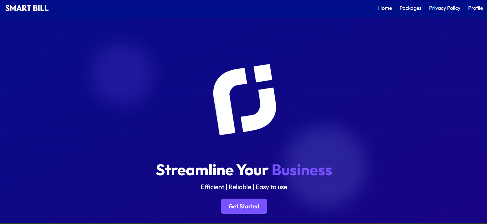

#### 🔹 Home  
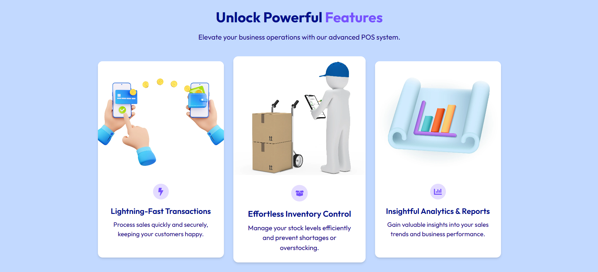

#### 🔹 Home 
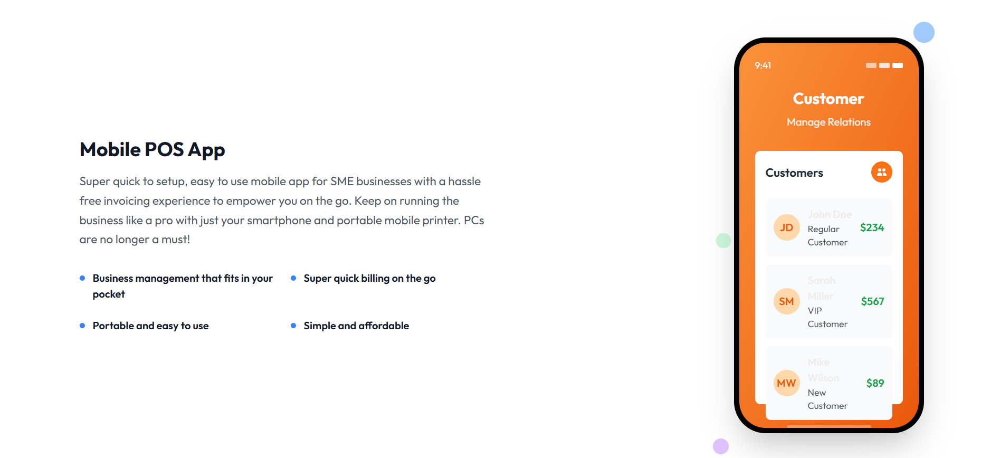

#### 🔹 Home  
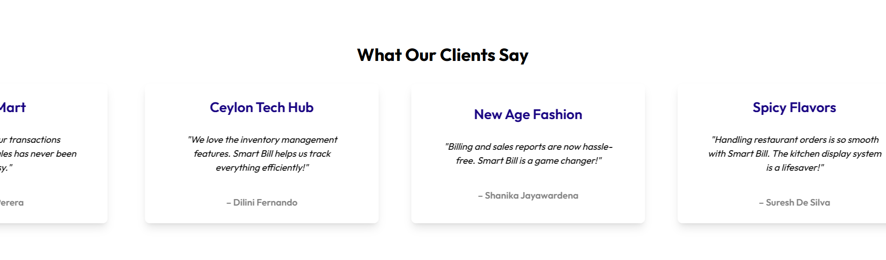

#### 🔹 Home  
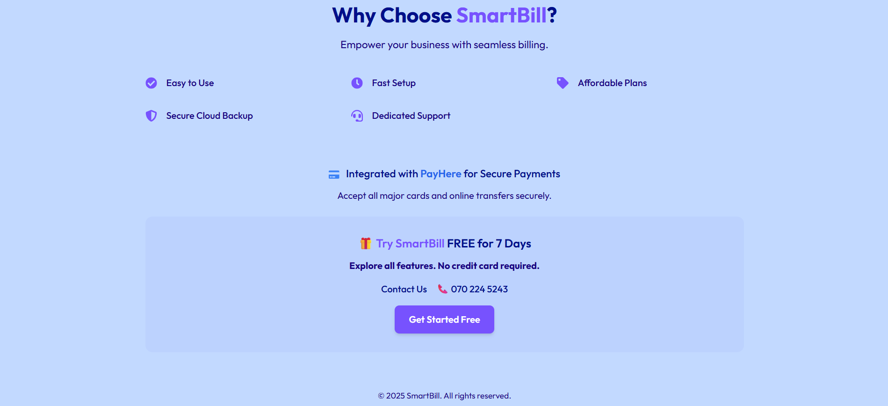

#### 🔹 Packages  
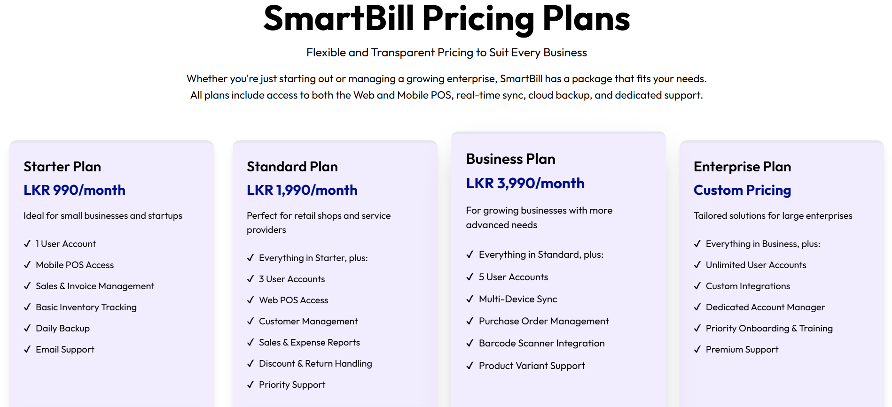

#### 🔹 Privacy Policy
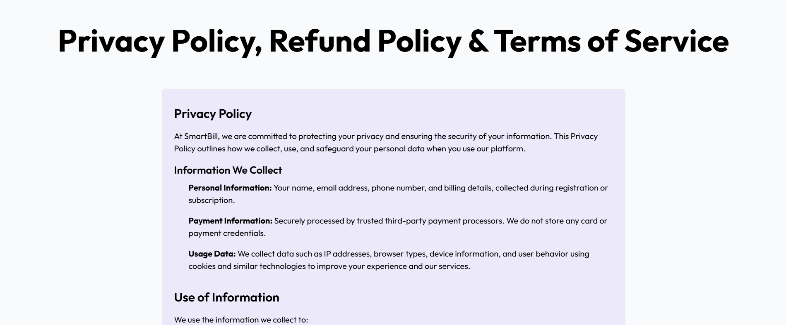

#### 🔹 Privacy Policy  
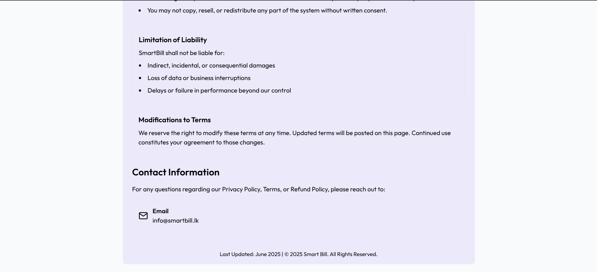

#### 🔹 User Profile  
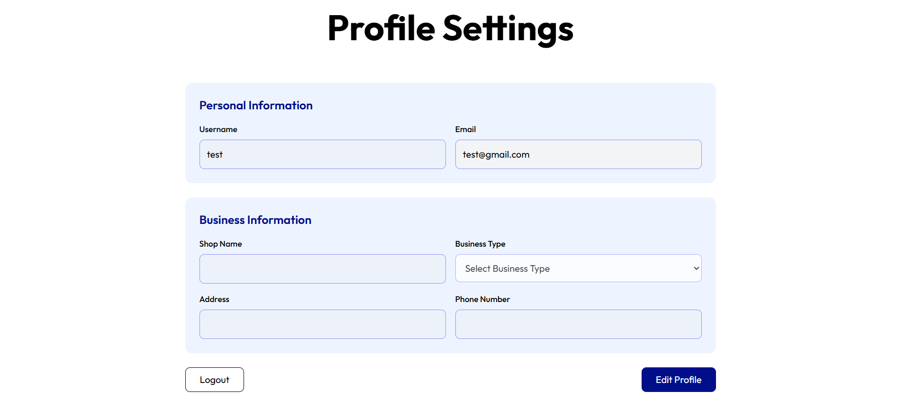

#### 🔹 Profile Update  
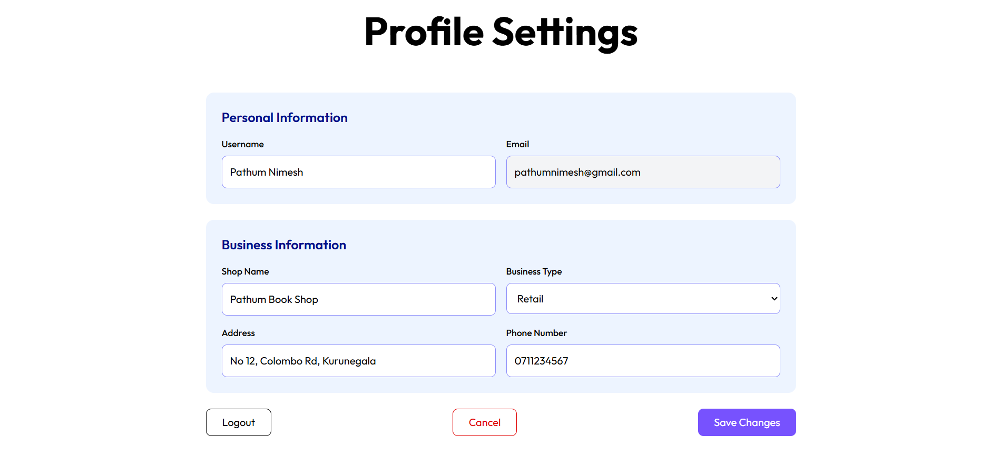

#### 🔹 Sign In 

#### 🔹 Sign Up 
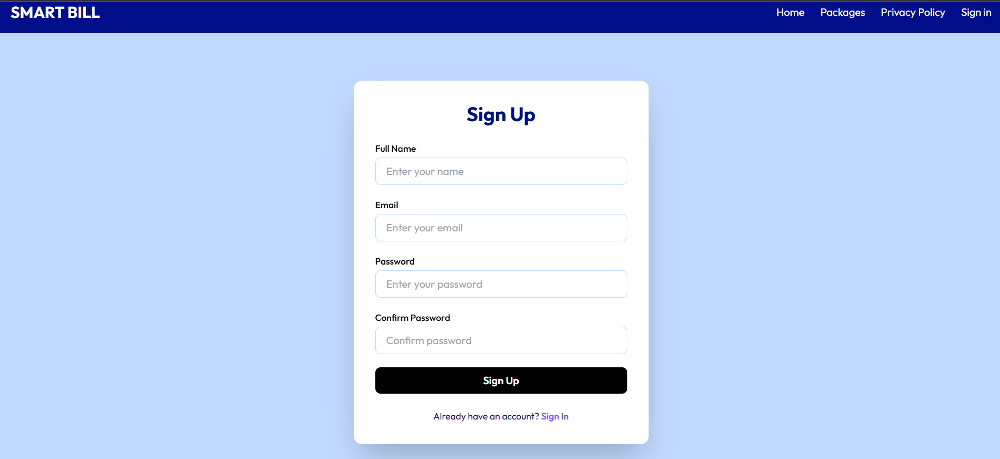

---

## 💡 Why This Project Stands Out

- ✅ Built from scratch using **Next.js** and best practices
- ⚙️ Smart state flow with **Zustand**
- 🔥 Real-time capabilities via **Firebase Firestore**
- 🎯 Designed with **business usability** and **client scalability** in mind

---